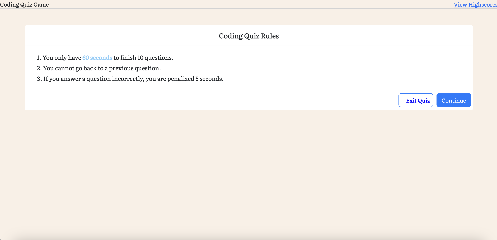

## Code Quiz

# Description

The purpose of the activity was to build a multiple-choice quiz with Javascript, which uses Document Object Model (DOM). It is meant to set data in Local Storage and retrieve it to display highscores from past games.

## Usage

Instructions: Clone remote repository, then run the working version of the application locally in VSCode by running index.html on a Live Server. The Github deployed version is not functional.

Video demonstration: https://drive.google.com/file/d/1QQB0tGt8G5Ag7LSyVaNsMi4-JcB28FKO/view?usp=sharing

Live website: https://lyubomirg1995.github.io/code-quiz/

